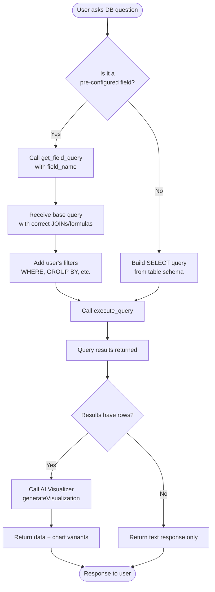

# System Architecture & Data Flow

## 1. High-Level Architecture


## 2. Detailed Data Flow


## 3. Data Models

### 3.1 Request/Response Models

```mermaid
classDiagram
    class ChatRequest {
        +string message
        +string user_id
        +string? chat_id
        +Object? user_location {lat, lng}
        +string? model
    }
    
    class ChatResponse {
        +string conversation_id
        +string message (summarized)
        +string message_raw
        +string[] toolsCalled
        +string model
        +Object usage
        +Place[]? places
        +Directions? directions
        +PlaceDetails? place_details
        +DistanceInfo? distance_info
        +SearchResults? search_results
        +NewsResults? news_results
        +ResearchResults? research_results
        +Visualization? visualization
    }
    
    class ConversationHistory {
        +string role (user|assistant|tool)
        +string content
        +string? tool_call_id
        +ToolCall[]? tool_calls
    }
    
    class ToolCall {
        +string id
        +string type
        +Object function {name, arguments}
    }
```

### 3.2 Database Models

```mermaid
classDiagram
    class User {
        +string id (PK)
        +string name
        +string email
        +Object? location {lat, lng}
        +string? timezone
    }
    
    class Conversation {
        +string id (PK)
        +string user_id (FK)
        +timestamp created_at
        +timestamp updated_at
    }
    
    class Message {
        +string id (PK)
        +string conversation_id (FK)
        +string role
        +string content
        +string? model
        +int? tokens
        +Object? structured_data
        +timestamp created_at
    }
    
    class DatabaseSchema {
        +string schema_name (PK)
        +string user_id (FK)
        +string client_name
        +string? referral
        +Table[] tables
        +Field[] available_fields
    }
    
    class Table {
        +string name
        +Column[] columns
    }
    
    class Column {
        +string name
        +string type
        +boolean nullable
    }
    
    class Field {
        +string name
        +string description
        +string source_table
        +string query_template
    }
    
    User "1" --> "N" Conversation
    Conversation "1" --> "N" Message
    User "1" --> "1" DatabaseSchema
    DatabaseSchema "1" --> "N" Table
    Table "1" --> "N" Column
    DatabaseSchema "1" --> "N" Field
```

### 3.3 Tool System Models


## 4. Component Responsibilities


## 5. Key Features & Workflows

### 5.1 Database Query Workflow



### 5.2 Google Tools Workflow (Contact Disambiguation)

```mermaid
flowchart TD
    Start([User: "Email John"])
    Search[Call search_contact<br/>name: "John"]
    
    Start --> Search
    Search --> CheckResult{Result type?}
    
    CheckResult -->|requiresDisambiguation| ShowList[Show numbered list<br/>of matches]
    ShowList --> WaitSelect[Wait for user selection]
    WaitSelect --> RememberIntent[Remember original action<br/>was 'send email']
    RememberIntent --> GetSelection[User picks: "1"]
    GetSelection --> Confirm
    
    CheckResult -->|noCloseMatch| ShowSuggestions[Show suggestions<br/>or ask for email]
    ShowSuggestions --> WaitClarify[Wait for clarification]
    WaitClarify --> Search
    
    CheckResult -->|Single match| Confirm[Show confirmation<br/>"Send to John Doe?"]
    
    Confirm --> UserConfirms{User confirms?}
    UserConfirms -->|Yes| Execute[Execute send_email]
    UserConfirms -->|No/Modify| AskChanges[Ask what to modify]
    AskChanges --> Confirm
    
    Execute --> Success([Email sent])
```

### 5.3 Location-Based Services


## 6. System Context & Prompt Building


## 7. Tool Injection Strategy


## 8. Summarization & Response Formatting


---

## Summary

This system implements a sophisticated multi-agent AI architecture with:

1. **Multi-modal tool integration** (Google, Maps, Search, Database)
2. **Context-aware prompt building** (location, database schema, user context)
3. **Intelligent model selection** based on query complexity
4. **Iterative tool execution** with result aggregation
5. **Structured data formatting** for rich client experiences
6. **Smart summarization** that adapts to user intent
7. **Secure multi-tenant database access** with pre-configured fields
8. **Comprehensive conversation history management**

The flow ensures that every user query is:
- Contextualized with relevant user data
- Routed to appropriate tools
- Executed with proper security controls
- Formatted intelligently for the frontend
- Persisted for conversation continuity
